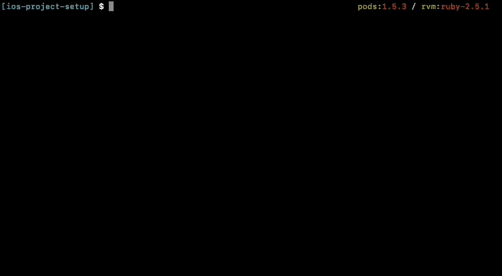

# Setup an iOS project environment

  

Nowadays an iOS project is more than only a `*.xcodeproj`  file with some self-written Objective-C or Swift files. We have a lot of direct and indirect external dependencies in our projects and each new developer on the project or the build server have to get these. The developers need these before developing on the app and the build server to build and deploy the app.

--- 
#### Table of Content
* [Types of dependencies](#types-of-dependencies)
* [Solutions for code dependencies](#solutions-for-code-dependencies)
* [Managing dependency chain](#managing-dependency-chain)
* [Solutions](#solution)
	* [Shell script](#shell-script)
	* [Makefile](#makefile)
	* [Rakefile](#rakefile)
* [Conclusion](#conclusion)
* [Demo project](#demo-project)
--- 

## Types of dependencies

We can separate the project dependencies in different categories:

**Code**: Because we don’t want reinvent the wheel for some parts in our apps again and again, we use third-party libraries for common use cases. E.g. we use [Alamofire](https://github.com/Alamofire/Alamofire "Alamofire") for our network stack. Also, we want use the latest and hopeful greatest version of each dependency, to get the newest features and especially critical bug fixes almost automatically. To reach this goal you should use a dependency manager, which cares about these problems. The principle „never change a running“ system should not apply to third-party dependencies. Especially if these are responsible for critical parts of the app, like encryption.

**Code Dependency Manager**:  To manage code dependencies in our project we currently have two famous dependency management systems in our iOS world: [Cocoapods](https://github.com/CocoaPods/CocoaPods "Cocoapods") and [Carthage](https://github.com/Carthage/Carthage "Carthage"). Both have almost the same feature set and care about two important requirements: 
1. Install the same versions of the dependencies on every system, so that every developer and the build server creates the same app artefact. 
1. Support to update to dedicated or latest versions of the dependencies
But neither _Cocoapods_ or  _Carthage_ are coming directly with macOS, therefore we have to install at least one of them. _Cocoapods_ is available as Ruby Gem and the preferred way to install _Carthage_ is via a _Homebrew_ package.

**Dependency Manager Management**:  To managed our iOS dependency manager, we should use some kind of dependency manager, too. 
_Cocoapods_ is available as Ruby Gem. So we should create an `Gemfile` for these type of dependencies. (Thats like the `Podfile` for Ruby developers. ) Than we need also the _bundler_ Ruby Gem to manage it. Look at [https://rubygems.org](https://rubygems.org/ "https://rubygems.org") and [https://bundler.io/](https://bundler.io/) for detailed information.
For _Carthage_ we use _Homebrew_ to install it. _Carthage_ will be installed via a shell command: `brew install carthage`. _Homebrew_ itself is only available via an Ruby installation script. (See [https://brew.sh](https://brew.sh/ "https://brew.sh"))

**Ruby**:  The primal dependency in this dependency chain is Ruby. The good news is that it is directly available on the latest macOS in an not so old version. But if you want the latest or a special Ruby version, you have to provide a way to install it. Besides compiling it from source code, you can use _RVM_ or _rbenv_, which also provides an environment management for _Ruby_.

## Solutions for code dependencies

After we see what dependencies an iOS project really have, we could face the possible solutions for it:

### Under version control

If you put your code dependencies in your version control system, you will have a compile-ready state of the project in your repository. Than it’s not needed, at least for the build server, to have a way to install all the other indirect dependencies, like _Cocoapods_. But a developer, who wants install new or update old code dependency will need them. 

### Not under version control

If you not put the code dependencies under version control, you have to provide a way that your colleagues and the build server can resolve and fetch them. The most important part is that everyone gets the same versions of each dependency, which is ensured via the `*.lock`  / `*.resolved` files of each dependency manager. These files freezes the versions of used dependencies and you have to force update the dependency versions for newer versions.
In this solution, it will be also easy to add, update or remove a dependency in each step, because every developer has the needed environment for it.  E.g. _fastlane_ is provided also as Ruby Gem, so you need only modify the `Gemfile` of the project and update the `Gemfile.lock`.
An negative aspect is, that all of the dependencies have to be always available. Nowadays, most of the code dependency are public hosted on Github.com and will be consumed from there. If a developer decides to remove his library from Github.com, you need to exchange the dependency or try to find another source of it.


Regardless which way you choose, in my opinion you should provide an easy way to setup the whole project environment. 

## Managing dependency chain

Currently there is no single right way to manage the whole dependency chain for an iOS project environment. It depends on the project and what parts  should be provided for the developers and what parts they want manage by their own. Especially for Xcode (Mac App Store or direct download from developer portal) and Ruby (_RVM_ or _rbenv_), each developer has it favourite way to manage it.


So, there is a part of the chain, which should already exists on the developers computer or the build server. For the rest, there exists three common ways to install all the project dependencies: Shell script, Makefile, Rake script

### Base setup

The base setup, which should be already on the developers computers, normally contains Xcode, Ruby and Homebrew. It depends whether you use _Cocoapods_  or _Carthage_ if you need _Homebrew_. But we take this as starting point.

**Xcode**: You can install the latest release version of Xcode via the Mac App Store ([https://itunes.apple.com/app/xcode/id497799835](https://itunes.apple.com/app/xcode/id497799835)), or via an direct download from the Apple Developer portal ([https://developer.apple.com/download/](https://developer.apple.com/download/)). If you use the Mac App Store version, you can auto update to the latest version, but have in mind that not every project is directly ready to run with the latest Xcode. 

**Ruby**: You can download the source code and compile it by your own ([https://www.ruby-lang.org/en/downloads/](https://www.ruby-lang.org/en/downloads/)). Or you use third party tools to manage it, like [rbenv](https://github.com/rbenv/rbenv) or [RVM](http://rvm.io/). With the third party tools you can easily update or switch the current used Ruby version. So, you should really have a look at it.

**Homebrew**:  For installation of _Homebrew_  a script is provided on the project website [brew.sh](https://brew.sh/). If you have install it, _Homebrew_ can be upgraded by their own: `brew update`

### Dependency setup

**Ruby dependencies**:  External dependencies for Ruby scripts are normally be managed via the packet manager system `RubyGems`. With the Gem _bundler_ its possible to install Gems from a _Gemfile_ like this:

```ruby
ruby "~> 2.5.1"

source 'https://rubygems.org'
gem 'cocoapods', '~> 1.5.3'
gem 'fastlane', '~> 2.100.1'
```

To install these dependencies, you only have to run `bundle install`. The first run of it produces also a `Gemfile.lock` file, which locks the version numbers for other clients. So its guaranteed that on every system the same artefact is produced. Therefore the `Gemfile.lock` should be committed in the project Git repository.

**Cocoapods dependencies**: Cocoapods manages the dependencies in their  _Podfile_ and _Podfile.lock_. With a call of `pod install` you install all of the dependencies in the right version. With `pod update` you can update the _Podfile.lock_ after changes in  _Podfile_. Also the _Podfile.lock_ needs to be in you project Git repository.

**Carthage dependencies**: Like _Cocoapods_, _Carthage_ has its _Cartfile_ and _Cartfile.resolved_ with the specified versions of the dependencies. With `carthage bootstrap` you can build the frameworks. The _Cartfile.resolved_ should also be in your Git repository. 


To install all the dependency a developer has to run the following commands:

```bash
# Installs bundler gem
gem install bundler

# Installs Gems with versions of Gemfile.lock
bundle install

# Installs Pods with versions of Podfile.lock
pod install

# Builds the frameworks with code versions of Cartfile.resolved
carthage boostrap 
```

## Solutions

After you have the base setup of your iOS project environment you have to find an easy and predictable way to execute all the steps for setup the iOS project environment. You should prevent your developer to read a long potential outdated documentation.

We want do the following steps:
* Check if Ruby is available
* Check if Homebrew is available
* Install Ruby Gems
* Install Cocoapods dependencies
* Install Carthage dependencies
* Open for additional steps

Additional steps could be triggering the build process and run the unit test, like with fastlane:

```bash
fastlane test
```

So the best way would be a solution where these steps are running with the other steps, but it should be also possible to run the additional steps only by their own, because you already could have setup your project environment.

### Shell script
The shell script solution is inspired by the [Firefox iOS App](https://github.com/mozilla-mobile/firefox-ios/) and their solution can be found here: [bootstrap.sh](https://github.com/mozilla-mobile/firefox-ios/blob/master/bootstrap.sh)

The script will be executed from top to bottom and executes all the necessary steps for setup the project environment. 

**Pros**:
* same syntax as manual entered commands
* groups manual entered commands in one file
* can contain checks for dependencies
* customisable and extensible with functions

**Cons**:
* Bash syntax
* no selective running of steps
* no easy integration of optional additional steps


I add the  `command_exists` function, to check if a executable is available in the current shell path.

The script will be executed from top to bottom and executes all the necessary steps.  It should be self explanatory:

```bash
#!/bin/bash

# Checks if executable exists in current path
command_exists () {
  command -v "$1" > /dev/null 2>&1;
}

echo "iOS project setup ..."

# Check if Ruby is installed
if ! command_exists ruby
then
  echo 'Ruby not found, please install it:'
  echo 'https://www.ruby-lang.org/en/downloads/'
  exit 1
fi

# Check if Homebrew is available
if ! command_exists brew
then
  echo 'Homebrew not found, please install it:'
  echo 'https://brew.sh/'
  exit 1
else
  echo "Update Homebrew ..."
  brew update
fi

# Install Bundler Gem
if ! command_exists bundle
then
  echo "Bundler not found, installing it ..."
  gem install bundler -v '~> 1.16.2'
else 
  echo "Update Bundler"
  gem update bundler '~> 1.16.2'
fi

# Install Ruby Gems
echo "Install Ruby Gems ..."
bundle install

# Install Cocopods dependencies
echo "Install Cocoapods"
pod install

# Install Carthage
echo "Install / Update carthage ..."
brew unlink carthage || true
brew install carthage
brew link --overwrite carthage

# Install Carthage dependencies
echo "Install Carthage Dependencies ..."
carthage bootstrap --platform ios --cache-builds

```

A new developer only needs to run `./project_setup.sh` to setup the iOS project environment.

If you want to add additional steps, you should write additional functions for each step. With parameters at the call of `./project_setup.sh`, you can control which step will be executed. For example, if we want to run our unit test, it would look like this

```bash
#!/bin/bash

echo "iOS project setup ..."

# Check if user only wants to run unit tests
only_test=false
[ "$1" == "only_test" ] && only_test=true

# Check if user wants to create build envirnoment
# and execute the unit tests
with_test=false
[ "$1" == "with_test" ] && with_test=true

# Run fastlane unit tests
unit_test() {
  fastlane test
}

# Run only unit tests
if $only_test 
then
  unit_test
  exit 0
fi

#
# All boostrapping steps
#

# Run unit tests after project setup
if $with_test
then
  unit_test
fi
```

We define a `unit_test` function, which will executed if the first parameter is `only_test` or `with_test`. You can call the shell script with

```bash
./project_setup.sh only_test
```

or

```bash
./project_setup.sh with_test
```

For `only_test`, the function `unit_test` will be executed at the beginning and the script ends. For `with_test`, the whole bootstrapping steps will be executed and afterwards the function `unit_test`. Without parameters only the project setup will be executed.

### Makefile

Inspired by the [Kickstarter](https://github.com/kickstarter/ios-oss "Kickstarter") ([Makefile](https://github.com/kickstarter/ios-oss/blob/master/Makefile "Makefile")) and [Wikipedia](https://github.com/wikimedia/wikipedia-ios "Wikipedia") ([Makefile](https://github.com/wikimedia/wikipedia-ios/blob/develop/Makefile "Makefile")) app, a Makefile can also be a solution to execute all the steps with one command.

Except from the shell script solution, it not executes all the steps from top to bottom, it’s execute a block, named `target`, by its name like:

```bash
make target_name
```

Only the commands in this `target` will be executed. But you can define other `targets` which should be executed before. So you have a chain of commands which will be executed one after the other.  You will see it in the example.

You can also define a default `target` which will be executed if no `target` name is given.

**Pros**:
* Same syntax as manual entered commands
* Groups manual entered commands in one file
* Can contain checks for dependencies
* Selective running of steps
* Easy integration of optional additional steps

**Cons**:
* Makefile syntax
* Limited customisable and extensible with targets


A Makefile can look like the example below and contains for each of our project setup steps a target.
The `setup` target  has only other targets as dependencies and doesn’t execute something. Targets after a colon of the target name will be executed before the target and in the defined order. So you can manage the execution order of your steps. 

The syntax of a Makefile is a little complicated, like the checks of the existing Ruby or Homebrew binaries shows, but normally you don’t need more. If you interested in more, read in the [make documentation](https://www.gnu.org/software/make/manual/make.html "make documentation").

```bash
# Checks if executable exists in current path
RUBY := $(shell command -v ruby 2>/dev/null)
HOMEBREW := $(shell command -v brew 2>/dev/null)
BUNDLER := $(shell command -v bundle 2>/dev/null)

# Default target, if no is provided
default: setup

# Steps for project environment setup
setup: \
	pre_setup \
	check_for_ruby \
	check_for_homebrew \
	update_homebrew \
	install_carthage \
	install_bundler_gem \
	install_ruby_gems \
	install_carthage_dependencies \
	install_cocoapods

# Pre-setup steps
pre_setup:
	$(info iOS project setup ...)

# Check if Ruby is installed
check_for_ruby:
	$(info Checking for Ruby ...)

ifeq ($(RUBY),)
	$(error Ruby is not installed)
endif

# Check if Homebrew is available
check_for_homebrew:
	$(info Checking for Homebrew ...)

ifeq ($(HOMEBREW),)
	$(error Homebrew is not installed)
endif

# Update Homebrew
update_homebrew:
	$(info Update Homebrew ...)

	brew update

# Install Bundler Gem
install_bundler_gem:
	$(info Checking and install bundler ...)

ifeq ($(BUNDLER),)
	gem install bundler -v '~> 1.16'
else
	gem update bundler '~> 1.16'
endif

# Install Ruby Gems
install_ruby_gems:
	$(info Install RubyGems ...)

	bundle install

# Install Cocopods dependencies
install_cocoapods:
	$(info Install Cocoapods ...)

	pod install

# Install Carthage
install_carthage:
	$(info Install Carthage ...)

	brew unlink carthage || true
	brew install carthage
	brew link --overwrite carthage

# Install Carthage dependencies
install_carthage_dependencies:
	$(info Install Carthage Dependencies ...)

	carthage bootstrap --platform ios --cache-builds

```

Each of the targets can also be execute by their own. You have to execute `make` only with the specific target name, like `make install_ruby_gems`

So, its also easy to add additional steps in our project setup. If you want to add the execution of the unit test in it, you define only an additional target (`unit_test`) for it.
If you want to execute the `setup` and the `unit_test` target together, you will define only an additional target with these targets as dependency.

```bash
# Combines project setup with unit tests
setup_with_unit_test: \
	setup \
	unit_test

#
# All other boostrapping steps
#

# Run fastlane unit tests
unit_test:
	$(info Run Unittests ...)

	fastlane test
```

So you can call 

```bash
make unit_test
```

to run only the unit tests, and 

```bash
make setup_with_unit_test
```

if you need also the project setup. Especially on an build server the last command is very useful.

### Rake
The [Wordpress](https://github.com/wordpress-mobile/WordPress-iOS/ "Wordpress") ([Rakefile](https://github.com/wordpress-mobile/WordPress-iOS/blob/develop/Rakefile "Rakefile")) app uses a Rakefile for its project setup. This is similar to the Makefile solution, but it uses the Ruby variant of make: [rake](https://github.com/ruby/rake "rake")

Therefore we don’t need a check for Ruby, because Ruby and `rake` are preconditions on the developers system to execute the Rakefile tasks.

Otherwise the Rakefile solution is very similar to their Makefile complement.
Each project setup step is in a `task` block and can be execute by its name, e.g.   `rake check_homebrew`.
It is also possible to have a default `task`, which will be execute if you only call `rake`, and each of the tasks can depend on others.

**Pros**:
* Groups manual entered commands in one file
* Can contain checks for dependencies
* Selective running of steps
* Easy integration of optional additional steps
* Customisation of build process via Ruby functionality

**Cons**:
* Needs rake on system
* Rakefile syntax
* Executes shell commands over an additional Ruby function `sh`

You can see an example below. The main task is `setup`, which only has other tasks as dependencies.  You can define dependencies with an arrow operator and the list of the dependencies.

Each of the task can contain any Ruby code. So, if you are familiar with Ruby, you can adapt this solution very fast. But you see also, that you will mostly only execute shell commands from your Ruby script. That’s why you should look, if you really need this additional abstraction layer.


```ruby
# Checks if executable exists in current path
def command?(command)
	system("command -v #{command} > /dev/null 2>&1")
end

# Default target, if no is provided
task default: [:setup]

# Steps for project environment setup
task :setup => [
	:pre_setup,
	:check_for_homebrew, 
	:update_homebrew,
	:install_bundler_gem,
	:install_ruby_gems,
	:install_carthage,
	:install_cocoapods_dependencies,
	:install_carthage_dependencies,
]

# Pre-setup steps
task :pre_setup do 
	puts "iOS project setup ..."
end

# Check if Homebrew is available
task :check_for_homebrew do
	puts "Checking Homebrew ..."
	if not command?('brew')
		STDERR.puts "Homebrew not found, please install it:"
		STDERR.puts "https://brew.sh/"
		exit
	end
end

# Update Homebrew
task :update_homebrew do 
	puts "Updating Homebrew ..."
	sh "brew update"
end

# Install Bundler Gem
task :install_bundler_gem do 
	if not command?('bundle')
		sh "gem install bundler -v '~> 1.16'"
	else
		sh "gem update bundler '~> 1.16'"
	end
end

# Install Ruby Gems
task :install_ruby_gems do
	sh "bundle install"
end

# Install Cocopods dependencies
task :install_cocoapods_dependencies do
	sh "pod install"
end

# Install Carthage
task :install_carthage do 
	sh "brew unlink carthage || true"
	sh "brew install carthage"
	sh "brew link --overwrite carthage"
end

# Install Carthage dependencies
task :install_carthage_dependencies do
	sh "carthage bootstrap --platform ios --cache-builds"
end
```

To add additional steps, you only have to add another task, like one for the unit tests

```ruby
# Run fastlane unit tests
task :unit_test do 
	sh "fastlane test"
end
```

You can call it directly with `rake unit_test`. To combine the project setup with the execution of the unit tests, you can define an extra task for it, which has the both tasks as dependencies.

```ruby
# Combines project setup with unit tests
task :setup_with_unit_test => [
	:setup,
	:unit_test
]
```

This can be execute with 

```ruby
rake setup_with_unit_test
```

## Conclusion

Anyway, if you use a shell script, a Makefile, a Rakefile or something else, you should provide an easy bootstrapping script for your iOS project. This makes it for new developers much easier to start and than also a build server needs only a one liner to build and deploy the app. The trouble with setting this up and learning some new script languages will it be worth.

Now, you can also easily use cloud continuous integration services like Travis CI, CircleCI or bitrise.io. Normally in the configuration of these services you will select an Xcode version and have also Ruby and Homebrew available. So your execution step will be the same, that every developer does on their local machine: `make setup_with_unit_test`.

My preferred solution would be a Makefile, because it has a integrated dependency management between the targets and is direct callable, which is not so easy available in a shell script solution. It sits also on `make`, which comes with every macOS in contrast to `rake`.
If you need to execute more complex steps, which is not the strength of a Makefile, your can break the steps into multiple Shell or Ruby scripts and call them from your Makefile.

## Demo project

I provide a demo project, where you can test all three solutions by your own.

**Shell script**

Project setup:

```bash
./project_setup.sh
```

Project setup with unit tests:

```bash
./project_setup.sh with_test
```

Unit tests:

```bash
./project_setup.sh only_test
```


**Makefile**

Project setup:

```bash
make setup
```

Project setup with unit tests:

```bash
make setup_with_unit_test
```

Unit tests:

```bash
make unit_test
```


**Rake**

Project setup:

```bash
rake setup
```

Project setup with unit tests:

```bash
rake setup_with_unit_test
```

Unit tests:

```bash
rake unit_test
```


The iOS project contains both, Cocoapods and Carthage dependencies, to show the different steps. Normally you would only use one of these code dependency manager. Also a fastlane `test` lane is provided, to execute example unit tests.